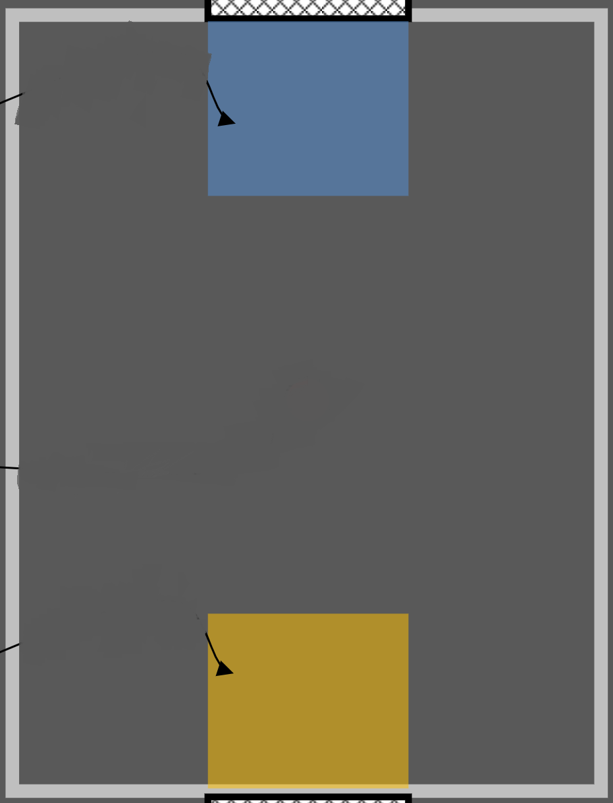

# Rocket-League-Simulation
### Written by Thomas Gira

## Introduction
This document outlines the work I did to create a Simulator for my teams MCEN 5115 Mechatronics 1 Project. This was done in order to practice and tune game playing algorithms without using a physical robot. This could be performed in a simulatro such as WeBots however this allowed for the learning of openCV. Working on this aspect of our project gave me a chane to learn openCV while contributing to our ptoject. Ultimately this algortihm was not used due to the overhead camera speed and the integration of our robot.

## Initial Map
In order to have a map for the game playing algorithm I made a copy of the map provided by Professor Reamon and edited it to remove all of the labels. This map was then read in using openCV and rescaled so the ratio was equivalent to the game playing field.

## Updating the Map

## Game Playing Algorithm

## Conclusion

## Improvements
