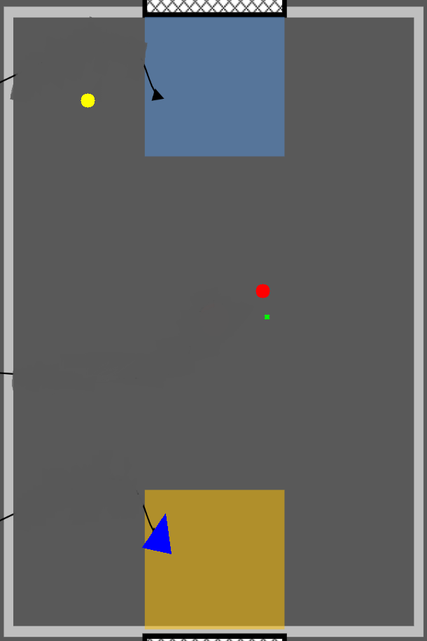

# Rocket League Simulation
### Written by Thomas Gira

## Introduction
This document outlines the work I did to create a Simulator for my teams MCEN 5115 Mechatronics 1 Project. This was done in order to practice and tune game playing algorithms without using a physical robot. This could be performed in a simulatro such as WeBots however this allowed for the learning of openCV. Working on this aspect of our project gave me a chane to learn openCV while contributing to our ptoject. Ultimately this algortihm was not used due to the overhead camera speed and the integration of our robot.

## Initial Map
In order to have a map for the game playing algorithm I made a copy of the map provided by Professor Reamon and edited it to remove all of the labels. This map was then read in using openCV and rescaled so the ratio was equivalent to the game playing field.


This map also had a scale multiplier so the size could be adjusted for different types of monitor resolutions. THis would also update the positional movement of objects on the playig field so they move at the same relative speed with different sized maps.

## Updating the Map
Within the inital map there were four different updating objects mapped each main loop iteration. There was a yellow circle for the opponent, A red circle for the ball, a green x for the goal position of the robot and a blue triangle for the robot. The ball, opponent and goal position all only included positional information. Since the opponent and ball locations would only be known from the overhead information, orientation would not be known so they could be represednted as a goal. For the goal position orientation and location would be known however, orientation would be shown when the robot reached the location and there was no need to show location.



The robot presented itself as more of a challenge to represent on the map. This was because position and orientation was necessary. In order to show both aspects, a blue triangle was used to represent the robot. The coordinates of the triangle used were determined by first getting the points of a triangle centered around an origin at (0,0) these points were then all converted from the robot coordinate frame into the world coordinate frame. The code used to accomplish this is shown below.

```python
def robotTriangle(): #Returns the points of a triangle corresponding to the robot's position and orientation.
    L = 250
    p1 = (L*np.sqrt(3)/3,0)
    p2 = (-L*np.sqrt(3)/6,L/3)
    p3 = (-L*np.sqrt(3)/6,-L/3)

    w1 = robot2World(p1)
    w2 = robot2World(p2)
    w3 = robot2World(p3)

    pts = np.array([(int(w1[0]*mapScale),height - int(w1[1]*mapScale)),(int(w2[0]*mapScale),height - int(w2[1]*mapScale)),(int(w3[0]*mapScale),height - int(w3[1]*mapScale))])
    return pts

def robot2World(cords): #Takes in robot coordinates (rx, ry, rt) and returns world coordinates (wx,wy,wt)
    x = posRobx + cords[0]*np.cos(posRobt)-cords[1]*np.sin(posRobt)
    y = posRoby + cords[0]*np.sin(posRobt)+cords[1]*np.cos(posRobt)

    return [x,y]
```

In order to get the position of the actual objects on the field a number of assumptions were made. The first being that physics doesnt exist. That meaning there was no physics based interactions of objects. The Opponent was hard coded just to move forward as a reference. The ball would stay put unless the robot was close enough, in which case it would "stick" to the front of the ball. The robot was assumed to move in the exact rotational and translations velocities as determined by the forward kinematics of the robot.

## Kinematics
Kinematics played a suprisingly large role in the function of this simulation. This was because of the way our inverse kinematics functioned. Our kinematics funtioned first by gathering the current pose of the robot and the goal pose of the robot. From this a "delta pose" was created and inverse kinematics was performed to get mecanum wheel speeds. These values were then normalized on a scale from -255 to 255. Because of this the goal velocities were not the same as the actual velocoties. Because of this forward kinematics were performed on the the motor speeds sent to the robot and velocities were calcuated from this. These velocites were multiplied by a time set to get the change in pose of the robot. The code used is shown below.

```python
def updateVelocity(): #Update the global velocity of the robot for positioning data
    global robotVelocity
    T = np.array([[1,1,1,1],[-1,1,1,-1],[-1/(lx+ly),1/(lx+ly),-1/(lx+ly),1/(lx+ly)]])/r #Translation matrix
    tempVelocity = np.dot(T,robotMotorSpeed) #Inverse Kinematics
    vx = tempVelocity[0]*np.cos(posRobt)-tempVelocity[1]*np.sin(posRobt)
    vy = tempVelocity[0]*np.sin(posRobt)+tempVelocity[1]*np.cos(posRobt)
    vt = tempVelocity[2]
    robotVelocity = [-vx[0],vy[0],vt[0]] #THIS SHIT IS FUCKED (IDK WHY ITS -vx)
    pass
```

## Game Playing Algorithm
The game playing algorithm may have been the simplest aspect of this project and can be broken down into the following states.
 parse -> execute;
   main -> init;
   main -> cleanup;
   execute -> make_string;
   execute -> printf
   init -> make_string;
   main -> printf;
   execute -> compare;
 }
'/>
## Conclusion

## Improvements
